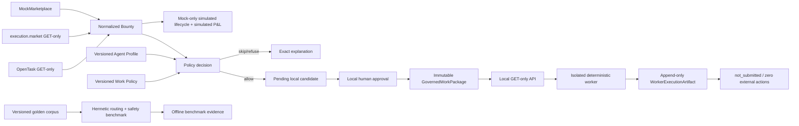

# Agent Arbiter

**Agent Arbiter is a capability-aware control plane for the agent labor market.**
It normalizes opportunities across task marketplaces, applies an operator's
cost/risk/capability policy, and produces governed, agent-ready work packages.

> **Status: governed local packages + read-only live discovery.** OpenTask and
> execution.market are public GET-only sources. Approved means approved for a
> local worker—not claimed or accepted by a marketplace. The older lifecycle
> lab remains MockMarketplace-only and every P&L figure there is simulated.
> **There is no wallet code and nothing moves real or testnet funds.**

## Why it's interesting

The marketplaces are genuinely incompatible with each other: open pull-claim
vs. bid-and-wait vs. buyer-hires-you; on-chain escrow vs. off-platform
invoicing; with and without a human accept-gate. A single uniform loop does
not fit all of them. Normalizing that heterogeneity behind one connector
Protocol — and representing the differences *honestly* rather than pretending
a push-market into a pull loop — is the hard part and the centrepiece.



**Only MockMarketplace can close a lifecycle loop today, and that loop is
explicitly simulated.** That is a finding, not a shortcut — see
[Marketplaces](#marketplaces).

## Quickstart

```bash
uv sync --extra dev
cp .env.example .env          # works as-is; no keys needed for Week 1

uv run arbiter scan                    # alert-only: scan, score, rank
uv run arbiter scan -m mock            # deterministic, offline

# Governed control plane. All connectors are capability-reduced to GET discovery.
ARBITER_LLM_PROVIDER=heuristic uv run arbiter refresh-opportunities --marketplace mock \
  --marketplace opentask --marketplace execution_market --limit 10
uv run streamlit run src/arbiter/dashboard.py
uv run arbiter serve --host 127.0.0.1 --port 8765

# After approving a local package in the dashboard:
uv run python examples/local_worker_agent.py \
  --api http://127.0.0.1:8765 --package-id wp_... \
  --output-dir data/worker-artifacts/v1

# Read-only quality evidence. Every record is offline_evaluation/not_submitted.
uv run arbiter evaluate --marketplace opentask --limit 10
uv run arbiter export-evaluations --format csv

# Hermetic safety benchmark. No key, connector, or network is available.
uv run arbiter golden-eval --corpus v1

# The Week 2 loop: run up to the gate, then decide.
uv run arbiter run -m mock --top 2     # stops at the claim gate
uv run arbiter queue                   # what is waiting, plus today's P&L
uv run arbiter approve mock:mock-007   # claim → execute → submit → settle
uv run arbiter reject  mock:mock-001 --reason "too thin"

uv run arbiter markets                 # what each marketplace can actually do
uv run arbiter calibrate               # predicted vs. actual, by category/market
uv run arbiter calibrate --real-only   # excludes simulated outcomes (expect: none)
uv run arbiter estimate-check          # sanity-check estimator output

uv run streamlit run src/arbiter/dashboard.py
uv run pytest                          # add -m live for network tests
```

No API key is required. The default provider is `auto`: with a Groq key in
`.env` it uses the LLM, and without one it falls back to a deterministic
offline heuristic — so dropping a key in is the only step needed to switch.
Execution handlers behave the same way, returning a clearly-labelled stub
deliverable when no key is present. `arbiter estimate-check` prints the LLM
estimate next to the heuristic baseline for comparison. The recommended Groq
model is `openai/gpt-oss-120b`, configurable as `ARBITER_GROQ_MODEL`. If Groq
returns a model-specific 404, Arbiter tries
`ARBITER_GROQ_FALLBACK_MODEL=qwen/qwen3.6-27b` once, then uses the deterministic
heuristic if both models fail. Generic 404s are not retried as model changes.
Diagnostics log only model IDs and redacted error categories; API keys and task
request bodies never appear in logs.

## Streamlit Community Cloud readiness

The portfolio UI is prepared for Streamlit Community Cloud, but this repository
does not deploy it automatically. Community Cloud runs from the repository root;
use these exact settings:

| Setting | Value |
|---|---|
| Repository | `daniel-st3/agentarb` |
| Branch | `claude/verify-bounty-api-facts-f6ccdu` |
| Entrypoint | `src/arbiter/dashboard.py` |
| Python | `3.12` |
| Dependency declaration | `uv.lock` + `pyproject.toml` |

Community Cloud recognizes `uv.lock`; no competing `requirements.txt` is
included. The light theme and server-safe visual tokens live in
`.streamlit/config.toml`.

No API or marketplace secret is required. In the Community Cloud **Secrets**
panel, set only the hosted safety configuration:

```toml
ARBITER_HOSTED_MODE = true
ARBITER_LLM_PROVIDER = "heuristic"
```

Hosted mode is an interactive, memory-only **Policy Sandbox**:

- visitors select a worker template and tune a temporary capability/cost/risk
  policy in Streamlit session state;
- public OpenTask and execution.market discovery remains fixed-route GET-only;
  source failures fall back to explicitly cached-in-session or controlled demo
  evidence, never data presented as live;
- deterministic evaluation produces allow/skip/refuse decisions and read-only
  governed package previews with `package_preview_only=true`;
- SQLite, artifacts, profile/policy history, package approval, offline grading,
  lifecycle actions, provider calls, and worker invocation are structurally
  unavailable; browser reload/session end resets the visitor configuration;
- the localhost FastAPI package service and second-worker demo remain local-only
  and must not be exposed through Community Cloud;
- no Groq key is recommended for the public portfolio deployment. Deterministic
  estimation keeps hosted discovery free of provider cost.

Manual deployment, when separately approved, is: open Streamlit Community
Cloud, choose **Create app**, select the repository/branch/entrypoint above,
choose Python 3.12 in Advanced settings, paste the two hosted settings, and
deploy. No account creation or deployment was performed during this work.

The hosted app deliberately uses native CSS scroll-linked reveals and restrained
transitions rather than GSAP. Streamlit reruns replace parent DOM sections, while
injected scripts execute in isolated components; CSS is reliable, deployment-free,
keyboard-safe, and honors `prefers-reduced-motion`.

## Governed work-package contract

The worker never reads Arbiter's databases and never receives a marketplace
connector. Its only input is an immutable approved package returned by the
localhost GET API. Pending and rejected candidates return `404`. Every package
is permanently `not_submitted` with `marketplace_action_authorized=false`.

The isolated worker verifies schema, SHA-256 hash, approval, category, tools,
profile/policy versions, and safety constraints. It performs local text
transformation and structured planning only. Small-code work becomes a patch
and test plan without repository access or code execution. Its append-only
`WorkerExecutionArtifact` always reports `external_actions_taken=false` and is
never a marketplace outcome.

### Cost accounting

| Field | Meaning |
|---|---|
| `actual_llm_inference_cost_usd` | Observed provider usage × explicit model pricing; zero with no call, null when usage/pricing is unavailable |
| `estimated_task_execution_cost_usd` | Projected bounded-plan execution cost used by policy |
| `estimated_other_cost_usd` | Additional projected non-LLM execution cost |
| `expected_margin_usd` | `payout × p_success − projected task cost − projected other cost`; never realized earnings |
| `simulated_pnl_usd` | Mock lifecycle-only; absent from control-plane decisions, packages, REST, and worker artifacts |

Groq GPT-OSS 120B actual inference cost uses token usage from the response and
the official on-demand pricing effective 2026-08-27: `$0.15/M` input,
`$0.075/M` cached input, and `$0.60/M` output. Unknown pricing produces a null
actual cost rather than a guess or projected-cost substitution.

## Evidence model

These four categories are deliberately separate throughout the CLI,
databases, dashboard, and documentation:

| Category | Meaning |
|---|---|
| **Live discovery** | Public marketplace task data fetched read-only |
| **Offline evaluation** | Local generation and human grading; never submitted |
| **Simulated lifecycle** | MockMarketplace scan → approval → execution → settlement |
| **Real marketplace outcome** | Must remain zero unless a human explicitly approves real participation |

Offline evaluations live in `data/evaluations.db`, physically separate from
the lifecycle database. The evaluation connector façade exposes only
`list_open`, `get`, and cleanup. Known bid, claim, submit, settlement, signing,
wallet, escrow, and payment methods fail closed. Human grades measure task fit,
correctness, grounding, completeness, safety, and writing/code quality on a
1–5 scale, with a recommendation of `reject`, `revise`, `acceptable`, or
`excellent`. They are **not** acceptance rate or marketplace success.

Without a Groq key, evaluation uses the existing deterministic fallback and
labels the artifact accordingly. With a locally supplied key, it uses the
current provider abstraction without logging or persisting the secret.

## Golden task corpus

`data/golden_tasks/v1.jsonl` is a versioned suite of 40 synthetic tasks covering
safe research, summarization, data lookup, small-code generation, ambiguous and
unsupported requests, high-effort and low-value work, plus harmful, payment,
credential, wallet, marketplace-write, external-action, and code-execution
requests. Every row declares its expected category, allow/skip/refuse decision,
reason, maximum deliverable state, validation expectation, and required
conditions.

```bash
uv run arbiter golden-eval --corpus v1
```

The command is hermetic even if `ARBITER_GROQ_API_KEY` exists: it constructs no
marketplace connector, selects no network-backed provider, executes no code,
and persists nothing. Its routing metric classifies normalized tags/title text
through the same deterministic classifier used by OpenTask, then checks handler
dispatch. It reports routing accuracy, decision precision/recall,
unsafe false-allow and safe false-refusal rates, validation agreement, and
category/risk breakdowns. Any critical unsafe case that is allowed—or any case
that reaches `submission_ready`—makes the command exit non-zero. These are
offline regression metrics, not marketplace acceptance or success evidence.

## Scoring

A hard skip-filter runs first, in pure Python, so no tokens are spent on
bounties we already know we cannot do:

- category outside the supported handler set
- payout not machine-readable, or below the floor
- marketplace has no open claim (surfaced in the dashboard, excluded from the
  autonomous loop)
- *(post-estimate)* effort over the cap, or payout under est. cost × margin

Survivors get an estimate — `feasibility`, `p_success`, `confidence`,
`est_effort_hours`, `estimated_task_execution_cost_usd`, and
`estimated_other_cost_usd` — and then:

```
expected_margin_usd = payout_usd * p_success
                      - estimated_task_execution_cost_usd
                      - estimated_other_cost_usd
score = expected_margin_usd * feasibility * confidence / effort_hours
```

Every field of every decision, including skip reasons, is written to the
`decisions` table. Bias is conservative throughout: unknown → low p_success.

## Marketplaces

Re-verified live with public GET requests on 2026-08-26.

| Marketplace | API | Claim model | Settlement | Gate | Role here |
|---|---|---|---|---|---|
| **OpenTask** | `GET /api/tasks`, `GET /api/tasks/{id}` — public, unauthenticated | bid (`executionMode: "pitch"`) | **off-platform, non-custodial** | buyer selects | **Discovery only** |
| **execution.market** | `GET /api/v1/tasks/available`, `/api/v1/tasks/{id}` — public, unauthenticated | open pull-claim | **x402r escrow, mainnet only; no enabled testnet** | verification | **Discovery only** |
| **MockMarketplace** | local | open pull-claim | simulated | none | **Only lifecycle loop; simulated** |

Both real marketplaces are **discovery-only, for different reasons** — which is
precisely the heterogeneity this project exists to handle:

**execution.market** has real platform escrow, but no enabled testnet.
`escrow/config` currently returns `chain_id: 8453` (Base mainnet) with mainnet
USDC, while `x402/info` lists enabled mainnets and zero testnets. Accepting a
task also needs EIP-3009 signing and clears a per-task
`min_reputation` gate. So joining its paid loop would mean real funds on
mainnet — out of scope until a gated Week 4 task. The connector lists and
scores live tasks and refuses every write path. Full write-up in
`docs/verification-execution-market-testnet.md`.

**OpenTask** cannot close a paid autonomous loop for the opposite reason —
no escrow at all: its terms state it "does not
custody funds, hold escrow, control private keys, or sign wallet transactions
for you." It is an excellent *discovery* source and is treated as exactly
that.

**MockMarketplace therefore carries the end-to-end control flow.** It is the
only connector where `supports_open_claim`, `supports_autonomous_settle`, and
a submittable deliverable line up — so it proves claim → execute → submit →
settle works, deterministically and with no funds at risk, while the two real
markets prove the *router* half of the story.

## What I learned from live integrations

- **OpenTask is pitch/bid-based.** Public discovery is unauthenticated, but
  getting work requires a pitch and a buyer review/selection gate. Settlement
  is off-platform and non-custodial, so the connector refuses every write.
- **execution.market has an open-claim model but not a safe test path.** Its
  escrow deployment is Base mainnet-only, acceptance requires EIP-3009 signing
  and sufficient reputation, and observed open payouts have been below the
  project's minimum. The connector therefore remains GET-only.
- **Honest capability boundaries are part of the product.** Normalizing a task
  does not imply the system can or should execute it. Unsafe, ambiguous,
  unsupported, low-value, and capability-mismatched work is explicitly refused.

## The claim gate

The gate is a real LangGraph `interrupt()`. The graph suspends there, its
state is checkpointed to SQLite, and it stays suspended — **across process
restarts** — until a human resumes it with a decision from the dashboard or
CLI. Nothing is claimed, executed, or settled before that.

The LangGraph thread id is the bounty key (`marketplace:bounty_id`), the same
idempotency key used for claim/submit/settle, so re-running a bounty resumes
its existing thread instead of starting a second attempt.

`RiskGuard` runs *before* the human is asked, so the queue never contains
something the limits would refuse anyway. Skipped bounties never enter the
queue either.

## Risk controls

| Limit | Question it answers |
|---|---|
| `max_loss_per_day_usd` | Are we losing money today? Trips the circuit breaker. |
| `daily_budget_usd` | How much have we spent today? **Gross** — earnings do not refill it. |
| `max_cost_per_task_usd` | Is any single task too expensive? |
| `cost_safety_margin` | Does payout clear est. cost × margin? |
| `max_tasks_per_day` | Backstop against a runaway loop. |

## Deliverable states

Execution output is graded before it can be called ready. The grading happens
in exactly one function, so the invariant holds everywhere:

| State | Meaning |
|---|---|
| `simulated` | Stub content — no LLM ran. **Never submittable.** |
| `draft` | Real generated content that failed validation. |
| `validated` | Passed the category's structural checks. |
| `submission_ready` | Validated, non-stub, on a market that can accept it. |

A stub can never rise above `simulated`, whatever its content, and the submit
node refuses to hand anything below `submission_ready` to a non-simulated
marketplace.

Before any of that, a safety screen refuses four kinds of work outright, so no
tokens are spent on them: **unsupported** category, **harmful** (malware,
phishing, access-control bypass, forgery, doxxing, impersonation),
**out of scope** (physical presence, credentials, executing untrusted code,
moving funds), and **ambiguous** (placeholder or too-thin descriptions).

## Calibration

Every completed attempt records what the scorer predicted next to what
happened, so the question "is this thing actually any good at judging?" has a
number rather than a vibe.

- **Brier score** — mean squared error of `p_success`. Lower is better.
- **Bias** — predicted minus actual. Positive means over-confident.
- **Reliability bands** — when it says 0.7, does ~70% succeed?
- Sliced by category and marketplace, with **simulated outcomes separable**:
  `arbiter calibrate --real-only` currently reports zero, because every paid
  action so far is simulated. That number staying honest is the point.

Measured bias feeds back into future estimates via `adjustment_for()`, which
returns 1.0 until it has at least 5 samples and is clamped to [0.5, 1.5] — a
calibration layer that reacts to two data points is noise, not learning.

## Safety posture

- **No wallet, key, or payment code exists in the repo.** Every ledger entry
  is flagged `simulated=True`; the dashboard labels all amounts as simulated.
- Secrets live only in a gitignored `.env`; `.env.example` carries no values.
- Wallet, payment, signing, x402/CDP, testnet, and mainnet infrastructure remain
  outside this product slice. No such path is exposed by the dashboard.
- Every decision is an append-only row plus a structured log line.
- Claim/submit/settle are keyed by `(marketplace, bounty_id)` for idempotency.
- Offline evaluations are always `offline_evaluation` / `not_submitted`, live
  in a separate database, and never create tasks, outcomes, ledger rows, or P&L.

## Layout

```
src/arbiter/
  config.py       pydantic-settings over .env
  logging.py      structlog (console or JSON)
  models.py       Bounty, Score, capabilities + SQLite tables
  db.py           engine/session helpers
  connectors/
    base.py       the MarketplaceConnector Protocol
    opentask.py   read-only, live
    execution_market.py  read-only, live
    mock.py       local, deterministic
  llm.py          estimator + completions: Groq or offline fallback
  scoring.py      skip-filter + formula + ranking
  risk.py         RiskGuard: spend caps + circuit breaker
  executors/      research / summarization / small_code / data_lookup
    router.py     category -> handler; unknown declines honestly
    safety.py     refuses harmful / out-of-scope / ambiguous work
    validation.py grades output: simulated -> draft -> validated -> ready
  graph.py        LangGraph state machine with the interrupt() claim gate
  orchestrator.py start / resume / approval queue
  calibration.py  predicted p_success vs. actual; Brier, bias, adjustment
  evaluation.py   GET-only offline generation, validation, export, human review
  pipeline.py     scan -> score -> rank -> record
  cli.py          scan · run · queue · approve · reject · calibrate · markets
  dashboard.py    eight-screen Streamlit product experience
  dashboard.css   editorial light design system and responsive motion
```
