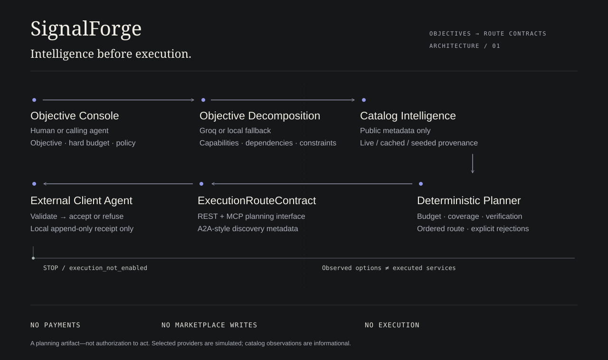
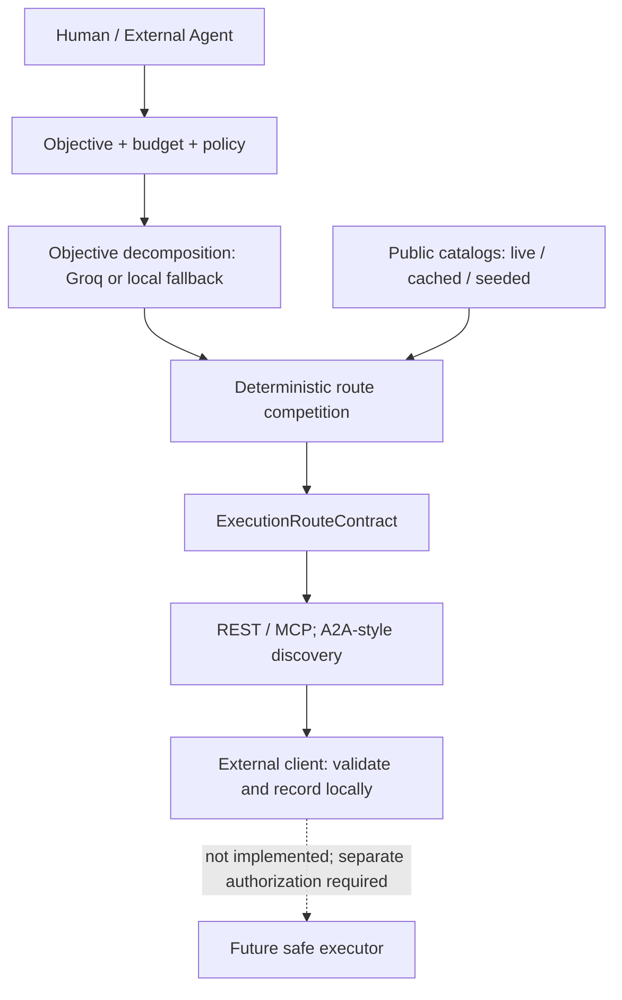

# SignalForge

**Agent-routing intelligence: objectives → budget-constrained execution route contracts.**

[Production](https://signalforge-rose-two.vercel.app/en) · [Network](https://signalforge-rose-two.vercel.app/en/network) · [Agent integration proof](https://signalforge-rose-two.vercel.app/en/developers/try) · [Español](https://signalforge-rose-two.vercel.app/es) · [Français](https://signalforge-rose-two.vercel.app/fr)

An agent can discover tools without knowing which combination fits its objective, budget or evidence requirements. SignalForge makes that decision inspectable: decompose an objective, compare capability routes deterministically, and return a typed contract with dependencies, alternatives and stop conditions. **It plans; it does not execute.**



## What it does now

- An English, Spanish or French Objective Console, four policies, hard budget and honest local capability preview.
- Optional server-only **Groq** decomposition; deterministic localized fallback without keys or on failure. Models cannot relax critical requirements or select providers.
- Public catalog observation, source-specific caching, timestamps, freshness and a filterable Network explorer.
- Cent-based deterministic route competition: cost, capability coverage, reliability, latency and independent verification. Partial routes are explicit.
- Zod-validated `ExecutionRouteContract`, REST planning, Streamable HTTP MCP tools and A2A-style discovery metadata.
- A **separate client agent** that consumes REST/MCP, refuses unsafe/incomplete contracts and writes an exclusive-create local receipt.
- Session-memory demonstrations, fictional research-output examples and shared Upstash cache/rate limiting when configured.

Unlike a chatbot, the result is a structured capability/dependency contract—not an asserted answer. Unlike a directory, it compares combinations under constraints and explains exclusions.

## What it deliberately does not do

No service execution, payments, wallets, signing, marketplace bids/claims/submissions, account automation, arbitrary URL fetching, trading or custody. Public catalog GETs and optional Groq decomposition are intelligence inputs, not task execution. Listed services are **NOT CALLED / NOT PAID / EXECUTION DISABLED**.

Every contract includes `executionStatus: "execution_not_enabled"`, `servicesCalled: false`, `paymentsMade: false` and **$0 actual task-service spend**. Groq inference is separate and subject to the operator’s provider quota. A route contract is not execution authorization.

## Architecture



Plain-text equivalent: objective → decomposition → catalog-aware planner → contract → REST/MCP consumer → **stop**. Next.js/TypeScript is the deployed system; archived Python/Streamlit code remains an offline regression/reference surface, not a production dependency.

## Live Network and provenance

| Source | Observed metadata | Boundary |
|---|---|---|
| Official MCP Registry | Bounded server listings | No connection to discovered servers |
| APIs.guru | API specification metadata | No listed API invocation |
| Models.dev | Model catalog and unit-qualified prices | No catalog model inference |
| LiteLLM model-cost map | Model metadata and unit prices | No provider invocation |

`live` means successful catalog observation, not verified service performance. `cached_live` retains its original timestamp. `seeded_catalog` is static metadata; `simulated_demo` is authored fixture data. Unavailable sources never become fabricated live results. Per-token or unknown prices are not per-task quotes. Observed options stay separate from selected **simulated** route providers.

Coinbase Bazaar remains disabled pending redistribution authorization. Deployed task opportunities are controlled fixtures only. [Source assessments](docs/live-sources.md) · [Catalog notices](docs/catalog-notices.md).

## REST quickstart

```bash
curl --fail-with-body https://signalforge-rose-two.vercel.app/api/v1/routes/plan \
  -H 'Content-Type: application/json' \
  --data '{"objective":"Build a verified startup due-diligence route","budgetUsd":0.25,"optimizationPolicy":"most_verified","mode":"demo"}'
```

The response includes `route`, `decompositionSource` and warnings. The contract contains ObjectiveFrame, ordered capabilities/providers, rejected alternatives, observed supply, verification policy, budget and stop conditions. A $0.10 verification-first route can be partial and must not be treated as successful coverage. [OpenAPI](https://signalforge-rose-two.vercel.app/api/v1/openapi) · [API reference](docs/api.md).

## MCP and A2A-style discovery

Streamable HTTP: `https://signalforge-rose-two.vercel.app/api/mcp`.

Tools: `signalforge_plan_route`, `signalforge_search_catalog`, `signalforge_get_listing`, `signalforge_evaluate_opportunity`.

```json
{"jsonrpc":"2.0","id":1,"method":"tools/call","params":{"name":"signalforge_plan_route","arguments":{"objective":"Build a verified startup due-diligence route","budget_usd":0.25,"optimization_policy":"most_verified"}}}
```

Headers: `Content-Type: application/json`; `Accept: application/json, text/event-stream`. MCP initialization and stateless JSON responses are supported—not resumable execution tasks. [Connection guide](docs/mcp.md).

[Agent Card](https://signalforge-rose-two.vercel.app/.well-known/agent-card.json) is **A2A-style discovery-only metadata**, not a full A2A executor. [llms.txt](https://signalforge-rose-two.vercel.app/llms.txt) orients machine consumers.

## External Client Agent Demo

```bash
cd apps/signalforge
npm ci
npm run demo:client-agent -- \
  --objective "Build a verified startup due-diligence route" \
  --budget 0.25 --policy most_verified --output ./route-receipt.json

# Same contract over MCP; use a new receipt path.
npm run demo:client-agent -- --transport mcp --output ./mcp-receipt.json

# Intentional refusal; exit code 2 is expected.
npm run demo:client-agent -- --fixture unsafe-execution-enabled \
  --output ./refusal-receipt.json
```

Default endpoint is deployed SignalForge. Use `--endpoint http://127.0.0.1:3001` locally. Safe output ends with `ROUTE ACCEPTED FOR FUTURE SAFE EXECUTOR` and **Inspection only. This is not execution authorization.** Partial coverage, unsafe provenance or excess cost cause refusal. Receipt files are never overwritten. [Client guide](apps/signalforge/examples/client-agent/README.md).

## Local setup

Node 22.13+. No keys are needed for deterministic demo planning.

```bash
cd apps/signalforge
npm ci
npm run dev -- --port 3001
# Production-equivalent preview:
npm run build
npm start -- --port 3001
```

Use `.env.example` as the template; configure values privately in `.env.local` or Vercel. Never put secrets in source, URLs or `NEXT_PUBLIC_` variables.

## Vercel, Upstash and Groq

Use the existing SignalForge project, root **`apps/signalforge`**, build `npm run build`. Do not deploy or modify the legacy Vercel `web` project.

- `GROQ_API_KEY`: optional server-only objective decomposition.
- `UPSTASH_REDIS_REST_URL`, `UPSTASH_REDIS_REST_TOKEN`: read/write Upstash REST configuration; Vercel KV aliases supported.
- `RATE_LIMIT_SALT`: required for configured shared HMAC-derived caller keys. Raw IPs are not stored/logged.
- `CACHE_MODE=durable`: require shared storage; absent/invalid configuration fails closed. Unconfigured auto mode is an explicitly non-durable demo. Configured credentials never silently downgrade to memory.

Configure variables privately for intended Vercel environments. Upstash holds public catalog snapshots, health/cache metadata and hashed quota counters—not visitor objectives. Vercel filesystem writes are not durable storage; visitor routes remain session-memory only. [Durable setup](docs/durable-network.md) · [Security](docs/security.md).

## English, Spanish and French

Human routes: `/en`, `/es`, `/fr`, with `/network`, `/forge`, `/history`, `/developers` and `/developers/try`. Unprefixed links redirect to English. EN / ES / FR preserves path/query; the URL records language selection without a cookie. Canonical/hreflang metadata and sitemap entries cover translated pages.

UI and local decomposition display text are localized. User objectives and verbatim source excerpts retain their language. Provider names, JSON keys, enums, error codes and protocol/tool identifiers remain canonical. REST/MCP/Agent Card/OpenAPI/robots/llms URLs are stable and unprefixed. [i18n guide](docs/i18n.md).

## Verify

```bash
cd apps/signalforge
npm run lint
npm run typecheck
npm test
npm run build
npm run test:e2e
npm audit
# Explicit opt-in: configured Groq + safe Redis probes, status-only output.
npm run verify:runtime
```

Tests cover budget/critical-capability gates, refusal fixtures, no-execution boundaries, shared storage, client validation, locales, keyboard/reduced motion and stable protocols. Archived regression commands: [HANDOFF](HANDOFF.md).

## One-minute demo

**0–10s:** Enter due diligence, $0.25, Most verified; identify the local preview. **10–25s:** Decompose/compile; inspect a critical capability and rejection. **25–35s:** Inspect timestamped catalog context marked not called; switch EN → ES → FR. **35–50s:** Run the separate client over REST/MCP; show its receipt and unsafe-fixture refusal. **50–60s:** End at `execution_not_enabled`.

[Recording script](docs/demo-script.md) · [Architecture SVG](apps/signalforge/public/architecture.svg) · [Screenshots](docs/screenshots).

## Safe roadmap and repository identity

Validate contracts with external agent developers, measure usefulness of routing explanations, and distribute reproducible examples. Real adapters, provider-performance history and any future executor require separate design, authorization and safety review; they are **not implemented**.

Suggested GitHub topics: `ai-agents`, `agentic-ai`, `mcp`, `agent-to-agent`, `nextjs`, `vercel`, `groq`, `upstash`, `llmops`, `ai-infrastructure`. Repository rename is deliberately not performed.

[Retained prototype lessons](docs/pivot-notes.md) · [Interaction ownership](docs/interaction-system.md) · [Safety notes](docs/security.md).
